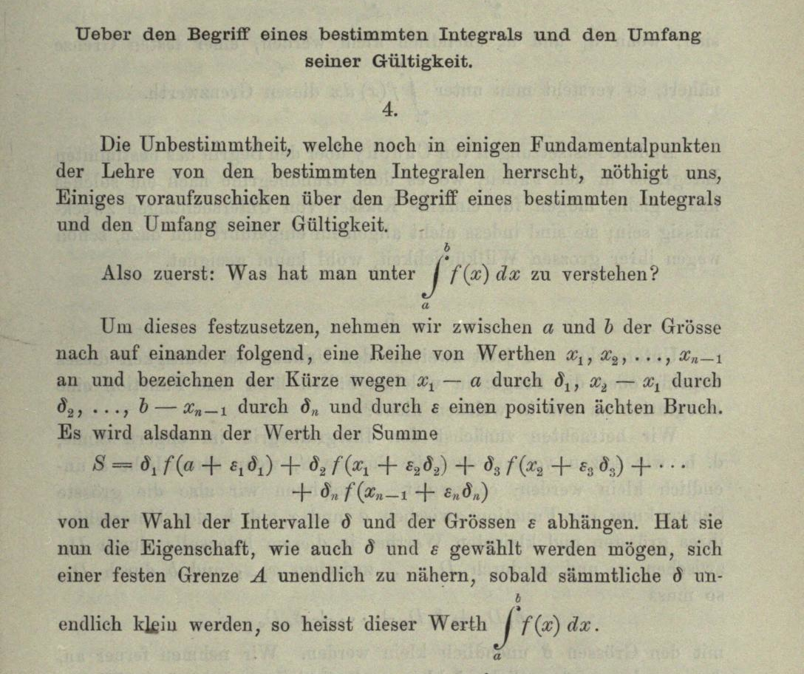

# Intégrales généralisées

## Introduction {.unnumbered}

Le but de ce chapitre est de généralisée la théorie de l'intégration vue en
première année -- qui se limite à des segments -- à des intervalles
*quelconques* . On donnera par exemple un sens à des intégrales comme
$\displaystyle\int_{1}^{\infty}\frac{dx}{x^{2}}$ ou
$\displaystyle\int_{0}^{1}\ln(x)dx$.

La théorie de l'intégration vue en première année est héritée de Riemann^[Georg
Friedrich Bernhard Riemann, mathématicien Allemand né le 17 septembre 1826 à
Breselenz, et mort le 20 juillet 1866 à Selasca, en Italie.] qui l'introduit
dans son article fondateur « Über die Darstellbarkeit einer Function durch eine
trigonometrische Reihe » (Sur la représentabilité d'une fonction par une série
trigonométrique) en 1854. 

L'intégrale y est définie via des *sommes*, qui portent
aujourd'hui le nom de *sommes de Riemann*. 

::: {#fig-somme-riemann}

La définition initiale de Riemann de l'intégrale à l'aide de sommes.
:::

L'énoncé moderne correspondant est le suivant:

::: {#def-somme-riemann}

#### Sommes de Riemann

Soit $f:[a,b] \to \mathbb{R}$ une fonction continue sur $[a,b]$, avec $a,b \in
\mathbb{R}$, $a \leqslant b$. Pour tout $n \geqslant 1$, on définit

$$
    U_{n} = \frac{b-a}{n}\sum_{k=0}^{n-1}f \left(a + k \frac{b-a}{n}\right)
$$

et 

$$
   V_{n} = \frac{b-a}{n} \sum_{k=1}^{n} f \left(a+ k \frac{b-a}{n}\right). 
$$

Alors les suites $(U_{n})$ et $(V_{n})$ convergent vers une limite commune
appelée intégrale de $f$ sur $[a,b]$ et notée $\int_a^b f(t)dt$.
:::

On peut montrer alors que la fonction $x \mapsto \int_a^x f(t)dt$ est une
*primitive* de $f$ sur $[a,b]$ et on aboutit à la définition usuelle de
l'intégrale donnée en première année : pour toute primitive $F$ de $f$ sur
$[a,b]$, 

$$
    \int_{a}^{b}f(t)dt = F(b)-F(a).
$$

Puisque qu'une telle primitive $F$ est nécessairement continue sur $[a,b]$
(elle y est de classe $C^{1}$), on a en particulier

$$
    \int_{a}^{b}f(t)dt = \lim_{x \to b^-} \int_{a}^{x}f(t)dt.
$$

Cette relation présente l'avantage de garder éventuellement un sens lorsque $f$
n'est pas définie en $b$, par exemple lorque $b=+\infty$ ; on parlera alors
d'intégrale *généralisée* de $f$ sur $[a,b[$. 

Les intégrales généralisées seront donc définies comme des *limites*
d'intégrales usuelles -- à condition que ces limites existent ! Contrairement aux
intégrales usuelles, les intégrales généralisées ne seront donc pas toujours bien
définies, et il faudra prendre plus de précaution lors de leurs manipulations.

Ces précautions étant prises, les intégrales généralisées se comporteront
essentiellement de la même manière que les intégrales usuelles. 

Les intégrales généralisées sont d'un usuage constant en mathématiques et en
physique (transformée de Laplace, de Fourier, fonction $\Gamma$ d'Euler,
intégrale de Gauss,...)

## Convergence d'un intégrale généralisée {#sec-convergence}

Dans tout ce chapitre, $I$ désigne un intervalle non vide de $\mathbb{R}$,
d'extrémités $a,b \in \mathbb{R}\cup \left\{ \pm \infty\right\}$, avec $a
\leqslant b$, et $\mathbb{K}$ désigne $\mathbb{R}$ ou $\mathbb{C}$. 

### Intégrales généralisées

::: {#def-integrale-generalisee}

Soit $f:I \to \mathbb{K}$ une fonction *continue* sur $I$ et $\alpha$ une
extrémité de $I$. On dit que l'intégrale de $f$ sur $I$ est **généralisée en
$\boldsymbol{\alpha}$** si $I$ est *ouvert* en $\alpha$. On dit que
l'intérgrale de $f$ sur $I$ est **généralisée** si elle est généralisée en au
moins une des extrémités de $I$. 

:::

::: {#nte-ambiguite .callout-note}

La phrase "l'intégrale de $f$ sur $I$" s'abrège usuellement $\int_{I}f$,
$\int_{I}f(t)dt$ ou $\int_{a}^{b}f(t)dt$. Il faut noter l'*ambiguité* de cette
dernière notation (qui est pourtant la plus utilisée) car elle ne précise pas
si les bornes $a$ et $b$ sont inclues ou exclues. C'est justement à vous que
revient de lever cette ambiguité pour étudier l'aspect généralisé ou non de
l'intégrale. 

:::

::: {#exm-simplement-generalisee-1}

L'intégrale $\int_{1}^{+\infty}\frac{dx}{x^2}$ est généralisée en $+\infty$
uniquement car la fonction $x \mapsto \frac{1}{x^{2}}$ est continue sur
$[1,+\infty[$.
:::

::: {#exm-simplement-generalisee-3}

L'intégrale $\int_{0}^{1}\frac{\ln(t)}{1-t}dt$ est généralisée en $0$ et en $1$
car la fonction $t \mapsto \frac{\ln(t)}{1-t}$ est continue sur $]0,1[$. On dit
qu'elle est *doublement* généralisée.

:::

::: {.callout-tip}
L'aspect généralisée d'une intégrale se lit sur le *domaine* de la
fonction intégrée.
:::

Que dire maintenant de l'intégrale de la fonction $x \mapsto x^{2}$ sur
l'intervalle $]0,1]$ ? Certe l'extrémité gauche est ouverte mais la fonction $x
\mapsto x^{2}$ est continue sur $[0,1]$... On peut de même se poser la question
de l'intégrale de la fonction $x \mapsto x\ln(x)$ sur l'intervalle $]0,1]$ qui
se *prolonge par continuité* en $0$. Ces situations correspondent au cas des
intégrales *faussement généralisées*, étudiées plus en détail dans la
@sec-integrale-faussement-generalisee.

### Convergence d'une intégrale généralisée

Jusqu'à présent, on s'est seulement entendu sur le sens de la phrase
"l'intégrale de $f$ sur $I$ est généralisée". Nous pas attribué de *valeur
numérique* à cette "intégrale". C'est le rôle de la notion de *convergence*.

::: {#def-cv-integrale-intervalle-semi-ouvert} 

#### Cas d'un intervalle semi ouvert à droite 

Soit $f:[a,b[ \to \mathbb{K}$ une fonction continue. On dit que l'intégrale de
$f$ sur $[a,b[$ **converge** si l'intégrale partielle
$\int_{a}^{x}f(t)dt$ admet une limite *finie* quand $x \to b^-$. On pose alors 
$$
\boxed{
	\int_{a}^{b}f(t)dt \underset{\small \mathrm{def}}{=}\lim_{x \to b^-}
\int_{a}^{x}f(t)dt}
$$
Dans le cas contraire, on dit que l'intégrale de $f$ sur $I$ **diverge**. La
convergence ou la divergence d'une intégrale s'appelle sa **nature**.
:::

:::{#fig-integrale-partielle-droite }

{#fig-integrale-partielle-droite}

Intégrale partielle et généralisée dans le cas $b=+\infty$.
:::

::: {#nte-existe .callout-note}

On dit aussi qu'une intégrale généralisée **bien définie** ou  **existe**
(en référence à la limite qui la définie) pour signifier qu'elle *converge*
; ce sont des synonymes. 

:::

::: {#exm-riemann-1}

L'intégrale $\int_{1}^{+\infty}\frac{dx}{x^{2}}$ converge et vaut $1$.

::: {.details}

Pour tout $x \geqslant 1$, on a 

$$
    \int_{1}^{x}\frac{dt}{t^{2}} = 1- \frac{1}{x} \underset{x \to +\infty}{\longrightarrow} 1.
$$

Donc l'intégrale $\int_{1}^{+\infty}\frac{dx}{x^{2}}$ converge et vaut $1$.

:::

:::

::: {#exm-riemann-3}

L'intégrale $\int_{1}^{+\infty}\frac{dx}{x}$ diverge.

::: {.details}

Pour tout $x \geqslant 1$, on a 

$$
    \int_{1}^{x}\frac{dt}{t} = \ln(x) \underset{x \to +\infty}{\longrightarrow} +\infty,
$$

donc l'intégrale $\int_{1}^{+\infty}\frac{dx}{x}$ diverge.

:::

:::

::: {#rem-convergence-integrande}

Les exemples précédents montrent qu'il ne faut pas confondre la convergence en
$+\infty$ de l'*intégrale* et de la *fonction intégrée* (l'intégrande). Par
exemple, la fonction $x \mapsto 1/x$ admet une limite en $+\infty$, mais
l'intégrale $\int_{1}^{+\infty}\frac{dx}{x}$ diverge. 

:::

::: {#fig-riemann-2 layout-ncol=2}

Des fonctions peuvent avoir des graphes similaires mais des intégrales de nature tout à fait différente.
:::

::: {#wrn-convergence-integrande .callout-warning}

Il ne pas confondre la convergence de l'*intégrale* en $\pm \infty$ et la
convergence de la fonction intégrée (l'*intégrande*). 

:::

Voici un autre exemple classique d'intégrale convergente.

::: {#exm-exponentielle}

L'intégrale $\int_{0}^{+\infty}e^{-t}dt$ converge et vaut $1$.

::: {.details}

Pour tout $x \geqslant 0$, on 

$$
    \int_{0}^{x}e^{-t}dt = 1-e^{-x} \underset{x \to +\infty}{\longrightarrow} 1.
$$

Donc l'intégrale $\int_{0}^{+\infty}e^{-t}dt$ converge et vaut $1$.

:::

:::

::: {#rem-semi-ouvert-a-gauche}
On définit de même la convergence d'une intégrale sur un intervalle semi ouvert
à gauche $]a,b]$ en considérant les intégrales partielles $\int_{x}^{b}f(t)dt$
quand $x \to a^{+}$ et en posant, en cas de convergence

$$
\boxed{
	\int_{a}^{b}f(t)dt \underset{\small \mathrm{def}}{=}\lim_{x \to a^+}
\int_{x}^{b}f(t)dt}
$$

:::

::: {#fig-convergence-ouvert-gauche}

{#fig-integrale-partielle-gauche}

Intégrale partielle et intégrable généralisée dans le cas $a=0$.
:::

::: {#exm-riemann-2}

L'intégrale $\int_{0}^{1}\frac{dx}{x^{2}}$ diverge. 

::: {.details}

Pour tout $\varepsilon>0$, on a 

$$
    \int_{\varepsilon}^{1}\frac{dx}{x^{2}} = \frac{1}{\varepsilon}-1 \underset{\varepsilon \to 0^{+}}{\longrightarrow} +\infty.
$$

Donc l'intégrale $\int_{0}^{1}\frac{dx}{x^{2}}$ diverge. 

:::

:::

On vient d'associer à certaine intégrales une valeur numérique. On va donc
pouvoir commencer à *calculer* avec des intégrales généralisées. Ce point sera
abordé plus en détail dans la @sec-calculer mais nous énonçons dès maintenant la
*relation de Chasles*, attendue de toute théorie satisfaisante de
l'intégration. 

::: {#prp-Chasles-semi-ouvert-droite}

### Relation de Chasles sur un intervalle semi ouvert

Soit $f:[a,b[ \to \mathbb{K}$ une fonction continue. Alors pour tout point $c \in [a,b[$, les intégrales
$\int_{a}^{b}f(t)dt$ et $\int_{c}^{b}f(t)dt$ ont *même nature* et, *en cas de
convergence*, on a 
$$
\int_{a}^{b}f(t)dt = \int_{a}^{c}f(t)dt + \int_{c}^{b}f(t)dt.
$$
:::

::: {#tip-chasles .callout-tip}
Si elles sont généralisées uniquement en $b$, les intégrales
$\int_{a}^{b}f(t)dt$ et $\int_{c}^{b}f(t)dt$ ont *même nature*.
:::

::: {#rem-version-semi-ouvert-gauche}
La @prp-Chasles-semi-ouvert-droite et le @tip-chasles se généralisent naturellement
au cas d'un intervalle semi ouvert à gauche $]a,b]$. 
:::

Une fois la convergence définie dans le cas d'intervalles semi ouverts, la
relation de Chasles -- que l'on veut valide pour les intégrales généralisées --
suggère la définition suivante dans le cas d'un intervalle ouvert.

::: {#def-cv-intervalle-ouvert}

#### Cas d'un intervalle ouvert

Soit $f:]a,b[ \to \mathbb{K}$ une fonction continue. On dit que l'intégrale de
$f$ sur $]a,b[$ **converge** si elle converge **en $\boldsymbol{a}$** *et* en
**en $\boldsymbol{b}$**, c.à.d s'il existe un  réel $c \in ]a,b[$, tel que les *deux*
intégrales $\int_{a}^{c}f(t)dt$ et $\int_{c}^{b}f(t)dt$ convergent. On pose
alors

$$
\int_{a}^{b}f(t)dt \underset{\mathrm{def}}{=}
\int_{a}^{c}f(t)dt + \int_{c}^{b}f(t)dt. 
$$

Dans le cas contraire, on dit que l'intégrale de $f$ sur $]a,b[$ **diverge**.
La convergence ou la divergence d'une intégrale s'appelle sa **nature**.

:::

::: {#rem-chasles}

Cette définition et la valeur de l'intégrale ne dépendent pas du point $c$
utilisé par la relation de Chasles satisfaite par les intégrales généralisées
sur un intervalle semi ouvert (@prp-Chasles-semi-ouvert-droite).

:::

::: {#exm-ouvert-convergente} 

L'intégrale $\int_{-\infty}^{+\infty}\frac{dx}{1+x^{2}}$ converge et vaut
$\pi$.

::: {.details}

Pour tout $w \geqslant 0$, on a 

$$
    \int_{0}^{x}\frac{dt}{1+t^{2}}= \arctan(x) \underset{x \to+\infty}{\longrightarrow} \frac{\pi}{2}.
$$

Donc l'intégrale $\int_{0}^{+\infty}\frac{dx}{1+x^{2}}$ converge et vaut
$\pi/2$.

De même, pour tout $x \leqslant 0$, on a 

$$
    \int_{x}^{0}\frac{dt}{1+t^{2}} = - \arctan(x) \underset{x \to -\infty}{\longrightarrow} \frac{\pi}{2}.
$$

Donc par *définition* l'intégrale $\int_{-\infty}^{+\infty}\frac{dx}{1+x^{2}}$
converge et vaut $\pi$.

:::

:::

::: {#exm-ouvert-divergente}

L'intégrale $\int_{0}^{+\infty}\frac{dx}{x^{2}}$ diverge car elle diverge en $0$. 

:::

::: {#tip-ouvert .callout-tip}

Montrer la convergence d'une intégrale sur un espace *ouvert*, c'est montrer la
convergence de *deux* intégrales "simplement" généralisées.

:::

### Intégrales faussement généralisées {#sec-integrale-faussement-generalisee}

Nous traitons ici le cas des intégrales dites *faussement généralisées*, comme
$\int_{]0,1]}x^{2}dx$ ou $\int_{]0,1]}x\ln(x)dx$, très
fréquentes en pratique. 

L'intuition voudrait que ces intégrales soient
convergentes, et que la valeur de l'intégrale ne dépende pas de l'inclusion ou
de l'exclusion des bornes de l'intégrale car "il n'y a pas d'aire sous un
point". La @prp-integrale-faussement-generalisee montre que c'est effectivement
le cas.

::: {#def-faussement-generalisee}

Soit $f:I \to \mathbb{K}$ une fonction continue et $\alpha$ une extrémité
ouverte de $I$. On dit que l'intégrale de $f$ sur $I$ est  **faussement
généralisée en $\boldsymbol{\alpha}$** si $f$ se prolonge par continuité en
$\alpha$. On dit que l'intégrale de $f$ sur $I$ est **faussement généralisée**
si $f$ se prolonge par continuité en chaque extrémité ouverte de $I$.

:::

La note suivante est à comparer au @wrn-convergence-integrande.

::: {#nte-borne-finie .callout-note}

Le prolongement par continuité est réservé aux extrémités *finies* de $I$. On
ne peut donc par parler d'intégrales "faussement généralisées en $\pm\infty$"
lorsque la fonction intégrée admet une limite finie en $\pm \infty$.

:::

::: {#exm-integrale-faussement-generalisee}

Les intégrales $\int_{]0,1]}x^{2}dx$ et $\int_{]0,1]}x\ln(x)dx$ sont toutes les
deux faussement généralisées en $0$ car $x^{2} \to 0$ quand $x \to
0^{+}$ et $x\ln(x) \to 0$ quand $x \to 0^{+}$ par *croissance comparée*.  

:::

::: {#prp-integrale-faussement-generalisee}

#### Convergence des intégrales faussement généralisées

Si l'intégrale de $f$ sur $I$ est faussement généralisée, elle est convergente
et 

$$
\int_I f = \int_{\bar{I}} f.
$$

:::

::: {#nte-adherence .callout-note}

Ici, $\bar{I}$ désigne l'*adhérence* de l'intervalle $I$ ; il s'agit du même
intervalle dans lequel on a refermé toutes les bornes ouvertes différentes de
$\pm \infty$. 

:::

::: {#nte-prolongement .callout-note}

Dans le théorème précédent, le prolongement par continuité de $f$ à $\bar{I}$
est encore noté $f$. La rigueur voudrait qu'on le note d'une autre manière,
mais l'usage prévaut. 

C'est l'occasion de rappeler qu'en mathématiques, une fonction vient toujours
avec un espace de *départ* et un espace d'*arrivée*, dont dépendent ses propriétés
(injectivité, surjectivité, régularité,...). Les changer, c'est
changer de fonction. 

Bien souvent, on "oublie" ces espaces pour ne préciser que
l'*action* de $f$ ; ils sont alors présents de manière *sous-jaccente*.

:::

::: {#exm-faussement-generalisee}

Les intégrales $\int_{]0,1]}x^{2}dx$ et $\int_{]0,1]}x\ln(x)dx$ sont toutes les
deux convergentes et on peut noter sans ambiguité leur valeur
$\int_{0}^{1}x^{2}dx$ et $\int_{0}^{1}x\ln(x)dx$.

:::

## Les théorèmes de comparaison {#sec-comparaison}

Les seules intégrales réellement intéressantes sont les intégrales
convergentes. Actuellement, nous disposons d'un seul outil pour
montrer la convergence d'une intégrale généralisée : revenir à une intégrale
partielle et espérer être capable de la calculer pour étudier sa limite. 

Malheureusement, peu d'intégrales sont effectivement calculables car il est
difficile de calculer des primitives, voir impossible^[Un théorème de Liouville
affirme par exemple qu'il n'existe pas de primitive de la fonction $t \mapsto
e^{-t^{2}}$ exprimable à l'aide de fonctions usuelles (polynômes,
exponentielles, logarithmes, trigonométriques).].

Face à ce constat, il est nécessaire de développer des outils permettant de
montrer qu'une intégrale converge sans pour autant calculer explicitement une
primitive de la fonction intégrée ; c'est le rôle des théorèmes de comparaison. 

### Le théorème de comparaison pour les fonctions positives

Tous les théorèmes de comparaison que nous allons démontrer sont basés sur le
théorème suivant, lui même conséquence du théorème de la limite monotone, qui
est un théorème abstrait d'existence de *limites*.

::: {#thm-comparaison-relation-leqslant}

#### Comparaison à l'aide de la relation $\leqslant$ pour les fonctions positives

Soient $f,g:I\to \mathbb{R}$ des fonctions continues sur $I$. On
suppose que 

1. $\forall t \in I,\ 0 \leqslant f(t) \leqslant g(t),$
2. l'intégrale de $g$ sur $I$ converge. 

Alors l'intégrale de $f$ sur $I$ converge. 
:::

::: {#rem-transfert-technique}

Le théorème de comparaison permet donc un *transfert de technicité*; on passe d'un calcul de
*primitive* à une *majoration*.

:::

::: {#exm-comparaison-fonction-positive}

Nature de l'intégrale $\int_{0}^{+\infty}\frac{1- \cos(t)}{t^{2}}dt$.

::: {.details}

L'intégrale proposée est généralisée en $0$ et en $+\infty$ car la fonction $t
\mapsto \frac{1- \cos(t)}{t^{2}}$ est continue sur $]0,+\infty[$. Un
développement limité montre que cette intégrale est faussement généralisée en
$0$ car 

$$
	\frac{1- \cos(t)}{t^{2}} = \frac{t^{2}/2 + o(t^{2)}}{t^{2}} \sim \frac{1}{2}
\underset{t \to 0^{+}}{\longrightarrow} \frac{1}{2}.
$$

De plus, on a 

$$
	\forall t \geqslant 1,\ 0 \leqslant \frac{1- \cos(t)}{t^{2}} \leqslant
\frac{2}{t^{2}}\tag{1},
$$

et l'intégrale $\int_{1}^{+\infty}\frac{dt}{t^{2}}$ converge. Donc par
compraison de fonctions *positives*, l'intégrale $\int_{0}^{+\infty}\frac{1 - \cos(t)}{t^{2}}dt$ converge en
$+\infty$^[On utilise ici implicitement la linéarité de l'intégrale convergente
: si l'intégrale de $f$ sur $I$ converge, alors l'intégrale de $\lambda f$ sur
$I$ converge pour tout $\lambda \in \mathbb{K}$.]. Donc par définition
l'intégrale  converge. 

*Attention, on ne peut pas utiliser directement la majoration $(1)$ et le
@thm-comparaison-relation-leqslant sur l'intervalle $]0,+\infty[$ car
l'intégrale $\int_{0}^{+\infty}\frac{dt}{t^{2}}$ diverge.*

:::

:::

::: {#rem-contraposee}

On peut aussi utiliser la *contraposée* de ce théorème ; si l'intégrale de $f$
du $I$ diverge, alors l'intégrale de $g$ sur $I$ diverge. On utilisera ce
résulat en TD pour montrer la divergence de l'intégrale de Dirichlet.

:::

### Intégrales absolument convergentes et fonctions intégrables

Le théorème de comparaison pour les fonctions positives permet déja de
démontrer la convergence (ou la divergence) de beaucoup d'intégrales, mais il
ne s'applique qu'à des fonctions à valeurs *positives* ; il ne permet pas de
traiter les fonctions à valeurs complexes, ou les fonctions dont le signe
alterne. La notion d'intégrales *absolument convergentes* et de fonctions
*intégrables* vient pallier efficacement cet inconvénient. 

::: {#def-integrale-absolument-convergente}

On dit que l'intégrale de $f$ sur $I$ est **absolument convergente** si l'intégrale
de $|f|$ sur $I$ converge.

:::

::: {#prp-absolue-convergence}

Si l'intégrale de $f$ sur $I$ converge absolument, alors elle converge.

:::

::: {#rem-contre-exemple}

On verra en TD avec l'exemple de l'intégrale de Dirichlet que la réciproque est
fausse.

:::

Cette propoosition est fondamentale car elle permet de montrer la convergence
d'une intégrale en se ramenant à l'intégrale d'une fonction *positive*
à laquel on peut appliquer le théorème de comparaison. 

::: {#exm-convergence-absolue}

Nature de l'intégrale $\int_{0}^{+\infty}\sin(t)e^{-t}dt$.

::: {.details}

On a 

$$
	\forall t \geqslant 0,\ 0 \leqslant \left|\sin(t)e^{-t}\right|
\leqslant e^{-t}.
$$

De plus, l'intégrale $\int_{0}^{+\infty}e^{-t}dt$ converge. Donc par
comparaison de fonctions positives, l'intégrale proposée converge *absolument*,
donc converge.

:::

:::

::: {#rem-positivite}

Si $f$ est de *signe constant* sur $I$, il n'y a pas de
différence entre la convergence absolue et la convergence de l'intégrale de $f$
sur $I$.

:::

Une fonction dont l'intégrale sur $I$ est absolument convergente est dite
*intégrable* sur $I$.

::: {#def-fonction-integrable}

On dit qu'une fonction continue $f:I \to \mathbb{K}$ est **intégrable** sur $I$
si l'intégrale de $f$ sur $I$ est absolument convergente. 

:::

::: {#wrn-integrable .callout-warning}

L'intégrabilité signifie plus que la simple *existence* de l'intégrale.  
 
:::

Lorsqu'une fonction est intégrable, on dispose d'une généralisation de
l'inégalité triangulaire usuelle qui stipule que *la valeur absolue d'une somme
est plus petite que la somme des valeurs absolues*. C'est une inégalité très
utile en analyse pour *majorer en valeur absolue* une intégrale.

::: {#prp-inegalite-triangulaire}

Si $f$ est intégrable sur $I$ alors

$$
    \left|\int_If\right|\leqslant \int_I |f|.
$$

:::

Le résultat suivant est une manière commode de dire que les fonctions
intégrables sont stables par *combinaison linéaire*.

::: {#prp-espace-vectoriel-fonction-integrable}

L'ensemble des fonctions intégrables sur $I$ est un sous-espace vectoriel du
$\mathbb{K}$-espace vectoriel des fonctions continues de $I$ dans $\mathbb{K}$.

:::

::: {#rem-espace-norme}

L'application $f \mapsto N(f) = \int_I|f|$ munit cet ensemble d'une structure
d'*espace vectoriel normé*. Cette notion, fondamentale en analyse, dépasse le
cadre de ce cours. C'est elle qui justifie l'intérêt de la notion
d'intégrabilité.

:::

On énonce maintenant les théorèmes de comparaison pour les fonctions
intégrables. Ce sont eux que l'on utilisera le plus souvent en pratique pour
montrer qu'une intégrale converge.

::: {#thm-theoreme-de-comparaison-o}

#### Comparaison à l'aide des relations $o$ et $O$ 

Soient $f,g:I \to \mathbb{K}$ deux fonctions continues sur $I$ et soit $\alpha$
une extremité ouverte de $I$. On suppose que $g$ est intégrable au voisinage de
$\alpha$ et que $f = o_{\alpha}(g)$ ou $f=O_{\alpha}(g)$. Alors $f$ est
intégrable au voisinage de $\alpha$. 

:::

::: {#thm-theorem-comparaison-equiv}

#### Comparaison à l'aide de la relation $\sim$

Soient $f,g:I \to \mathbb{K}$ deux fonctions continues sur $I$ et soit $\alpha$
une extrémité ouverte de $I$. On suppose que $f \underset{\alpha}{\sim} g$.
Alors $f$ est intégrable au voisinage de $\alpha$ ssi $g$ est intégrable au
voisinage de $\alpha$.

:::

::: {#rem-signe} 

Dans ces théorèmes, les signes de $f$ et $g$ sont sans
importance; c'est l'intérêt de la notion d'*intégrabilité*.

:::

::: {#nte-voisinage .callout-note}

#### Voisinages

Soit $\alpha$ une extrémité ouverte de $I$. Un **voisinage** de $\alpha$ dans $I$
est un intervalle non vide $V$ du type $[c,\alpha[$ (ou $]\alpha,c]$) avec $c \in
I$.

Si $f:I \to \mathbb{K}$ est une fonction de $I$ dans $\mathbb{K}$, on dit
qu'une propriété de $f$ est satisfaite **au voisinage de $\boldsymbol{\alpha}$** s'il existe
un voisinage $V$ de $\alpha$ dans $I$ sur lequel la propriété est
effectivement satisfaite.
:::

::: {#nte-relation-comparaison .callout-note}

#### Rappels sur les relations de comparaison

Soient $f,g:I \to \mathbb{K}$ et $\alpha$ une extrémité ouverte de $I$. On
suppose que $f$ et $g$ ne s'annulent pas au voisinage de $\alpha$. On dit que 

1. la fonction $f$ est **négligeable** devant $g$ au voisinage de $\alpha$, et
	 on note $f = o_{\alpha}(g)$, si 
$$
	\left|\frac{f(t)}{g(t)}\right|\underset{\substack{t \to \alpha \\ t \in I}}{\longrightarrow} 0,
$$
2. la fonction $f$ est **dominée** par $g$ au voisinage de $\alpha$, et on note
	 $f = O_{\alpha}(g)$, si le quotient $f/g$ est borné au voisinage de $\alpha$
i.e. s'il existe un voisinage $V$ de $\alpha$ dans $I$ et une constante
$M \geqslant 0$ tels que   
$$ 
\forall t \in V,\ \left|\frac{f(t)}{g(t)}\right|\leqslant M 
$$
3. la fonction $f$ est **équivalente** à $g$ en $\alpha$, et on note $f
	 \underset{\alpha}{\sim}g$, si 
$$
	\left|\frac{f(t)}{g(t)}\right|\underset{\substack{t \to \alpha \\ t \in I}}{\longrightarrow} 1.
$$

:::

::: {#tip-quotient .callout-tip}

Les relations $o,O$ et $\sim$ se lisent sur le *quotient* $f/g$ qui,
respectivement, *tend vers $0$, est borné, ou tend vers $1$*.

:::

::: {#rem-lien-relation}

La relation $\sim$ est *symétrique* i.e. $f \underset{\alpha}{\sim} g$ ssi $g
\underset{\alpha}{\sim} f$. C'est cette propriété qui est responsable de
l'*équivalence* du @thm-theorem-comparaison-equiv . De plus $o \Rightarrow O$ et
$\sim  \Rightarrow O$

:::

### Intégrales et fonctions intégrables de références

Maintenant que l'on dispose de théorèmes de comparaison, il reste à se
constituer une collection de fonctions intégrables dites de *références*,
suffisament riches pour être comparées aux fonctions rencontrées en pratique
; en l'occurence les fonctions puissances, la fonction logarithme et les
exponentielles décroissantes.

::: {#thm-riemann}

#### Intégrales de Riemann 

Soit $\alpha \in \mathbb{R}$. Alors la fonction $t \mapsto
\frac{1}{t^{\alpha}}$ est 

1. intégrable au voisinage de $0$ ssi $\alpha<1$,
2. intégrable au voisinage de $+\infty$ ssi $\alpha>1$.

:::

::: {#fig-riemann}

La différence ténue de convergence des intégrales de Riemann.

:::

::: {#rem-integrale-riemann}

Les intégrales $\int_{0}^{1}\frac{dt}{t^{\alpha}}$ et
$\int_{1}^{+\infty}\frac{dt}{t^{\alpha}}$ sont connues sous le nom d'*intégrales
de Riemann*.

:::

::: {#nte-fonction-puissance .callout-note}

#### Rappels sur les fonctions puissances

Pour $\alpha \in \mathbb{R}$, la fonction $f_{\alpha}:t \mapsto t^{\alpha}$ est
définie sur $]0,+\infty[$ par  

$$
	\forall t >0,\ t^{\alpha} = e^{\alpha \ln(t)}.
$$

La fonction $f_{\alpha}$ est de classe $C^{\infty}$ sur $]0,+\infty[$ et 

$$
	\forall t>0,\ (t^{\alpha})' = \alpha t^{\alpha-1}.
$$

Une primitive de $f_{\alpha}$ sur $]0,+\infty[$ est donnée par 

$$
	\begin{cases}
		t \mapsto \frac{t^{\alpha +1}}{\alpha +1}& \text{si $\alpha \neq 1$},\\
    t \mapsto \ln(t) & \text{si $\alpha =1$}.
	\end{cases}
$$

:::

::: {#fig-fonction-puissance}

Graphes des fonctions puissances

:::

::: {#tip-primitive .callout-tip}

Si $\alpha \neq1$, une primitive de $\frac{u'}{u^{\alpha}}$ est
$\frac{u^{-\alpha +1}}{-\alpha +1}$.

:::

::: {#exm-In}

Pour tout $n \in \mathbb{N}$, l'intégrale $I_{n}=\int_{0}^{\infty}t^{n}e^{-t}dt$ converge.

::: {.details}

Soit $n \in \mathbb{N}$. Par croissance comparée, on a 

$$
  \frac{t^{n}e^{-t}}{1/t^{2}} = t^{n+2}e^{-t} \underset{t \to
+\infty}{\longrightarrow} 0,
$$

donc $t^{n}e^{-t}=o_{+\infty}\left(\frac{1}{t^{2}}\right)$. De plus la
fonction $t \mapsto \frac{1}{t^{2}}$ est intégrable au voisinage de $+ \infty$.
Donc par comparaison, la fonction $t \mapsto t^{n}e^{-t}$ est intégrable au
voisinage de $+\infty$. Donc l'intégrale $I_{n}$ est (absolument) convergente.

:::

:::

::: {#tip-exp-decroissante .callout-tip}

La présence d'une *exponentielle décroissante* permet souvent de comparer la
fonction intégrée à la fonction $t \mapsto \frac{1}{t^{2}}$ via une *croissance
comparée*.

:::

::: {#thm-exponentielle}

#### Fonctions exponentielles

Soit $a \in \mathbb{R}$. La fonction $t \mapsto e^{\alpha t}$ est intégrable au
voisinage de $+\infty$ ssi $a<0$.

:::

::: {#exm-bornee}

Si $f:[0,+\infty[ \to \mathbb{C}$ est bornée, alors pour tout $p>0$,
la fonction $t \mapsto f(t)e^{-pt}$ est intégrable sur
$[0,+\infty[$^[L'intégrale $\int_{0}^{+\infty}f(t)e^{-pt}dt$ est donc
convergente ; on reconnait la *transformée de Laplace* de $f$.].

::: {.details}

Soit $p>0$. Par définition, il existe $M \geqslant 0$ tel que 

$$
	\forall t \geqslant 0,\ |f(t)|\leqslant M,
$$

donc $f(t)e^{-pt}=O_{+\infty}(e^{-pt})$. Puisque $p>0$, la fonction $t \mapsto
e^{-pt}$ est intégrable au voisinage de $+\infty$. Donc par comparaison, la
fonction $t \mapsto f(t)e^{-pt}$ l'est aussi. 

:::

:::

::: {#thm-logarithme}

#### Fonction logarithme

La fonction $\ln$ est intégrable au voisinage de $0$.

:::

::: {#rem-fonction-réciproque}

La convergence (et la valeur) de l'intégrale de $\ln$ sur $]0,1]$ était
prévisible au vu de l'@exm-exponentielle : les fonctions $\ln$ et $\exp$ sont
*réciproques* l'une de l'autre, donc leur graphe sont symétriques par rapport
à la première bisectrice. 

:::

::: {#fig-ln layout-ncol=2}

{#fig-exp-ln}

{#fig-exp-}

Convergence de l'intégrale $\int_{0}^{1}\ln(t)dt$.

:::

::: {#exm-comparaison-ln}

Nature de l'intégrale $\int_{0}^{1}\frac{\ln(t)}{1-t}dt$.

::: {.details}

L'intégrale est généralisée en $0$ et en $1$ car la fonction $t \mapsto
\frac{\ln(t)}{1-t}$ est continue sur $]0,1[$.

Au voisinage de $0^{+}$, on a 

$$
	\frac{\ln(t)}{1-t} \sim \frac{\ln(t}{1} = \ln(t)
$$

et la fonction $t \mapsto \ln(t)$ est intégrable au voisinage de $0$. Donc par
comparaison, l'intégrale $\int_{0}^{1}\frac{\ln(t)}{1-t}dt$ converge en $0$.
:::

:::

::: {#rem-valeurs}

En cas de convergence, il est bon de connaitre les valeurs des intégrales
$\int_{0}^{1}\frac{dt}{t^{\alpha}}$, $\int_{1}^{+\infty}\frac{dt}{t^{\alpha}}$,
$\int_{0}^{+\infty}e^{-at}dt$ et $\int_{0}^{1}\ln(t)dt$, ou d'être capable de
les retrouver rapidement. 

:::

## Calculer avec des intégrales convergentes {#sec-calculer}

### Propriétés des intégrales convergentes

Les intégrales convergentes héritent de toutes les propriétés préservées par
passage à la limite (égalités, inégalités larges,...). La philosophie générale
est la suivante :

::: {.callout-tip} *Sous réserve de convergence*, les propriétés des intégrales
généralisées sont les mêmes que celles des intégrales classiques. :::
 
On pourra donc manipuler des intégrales généralisées de la même manière que
l'on manipule des intégrales classiques, à condition de s'assurer que les
quantités manipulées existent ! 

::: {#prp-proprietes-integrale-generalise}

#### Propriétés des intégrales convergentes

Soient $f,g:I \to \mathbb{K}$ des fonctions continues sur $I$. On suppose que
les intégrales de $f$ et $g$ sur $I$ *convergent*. Alors

1. pour tout $\lambda \in \mathbb{K}$, l'intégrale de $f+\lambda g$ sur $I$
   converge et $$ \int_I (f + \lambda g) = \int_I f + \lambda \int_I g, \quad
   \textit{(linéarité de l'intégrale)} $$
2. la *relation de Chasles* est vérifiée pour tout point $c$ de $I$, $\quad
   \textit{(relation de Chasles)}$
3. si $\mathbb{K}=\mathbb{R}$ et si $f \leqslant g$ sur $I$, alors $$ \int_I f
   \leqslant \int_I g, \quad \textit{(croissance de l'intégrale)}. $$

:::

::: {#rem-positivite} 

On dit aussi que l'intégrale est *positive*^[On affinera cette propriété dans
le cours sur les espaces préhilbertiens en démontrant que l'intégrale est même
*définie positive*.] : si $f \geqslant 0$ sur $I$, alors $\int_If \geqslant 0$.
Cette propriété est équivalente à la croissance de l'intégrale par linéarité.

:::

::: {#exm-linearite}

En admettant (voir @exm-In) que pour tout $n \in \mathbb{N}$, l'intégrale
$I_{n}=\int_{0}^{+\infty}P(t)e^{-t}dt$ converge, alors pour tout $P \in
\mathbb{R}[X]$, l'intégrale $\int_{0}^{+\infty}P(t)e^{-t}dt$ converge comme
combinaison linéaire d'intégrales convergentes.

:::

::: {#exm-majoration}

Si l'intégrale de $f$ sur $[a,+\infty[$ converge et si $f \geqslant 0$ sur
$[a,+\infty[$, alors la relation de Chalses et la positivité de l'intégrale
montre que 

$$
	\forall x \geqslant a,\ \int_{a}^{x}f(t)dt \leqslant \int_{a}^{+\infty}f(t)dt.
$$

Cette propiétée est par ailleurs claire graphiquement, @fig-integrale-partielle-droite.
:::

::: {#exm-contrapose}

Si l'intégrale de $f$ sur $I$ converge, et si l'intégrale de $g$ sur $I$
diverge, alors l'intégrale de $f+g$ sur $I$ diverge^[On retrouve une propriété
usuelle des limites : *"convergent plus divergent égale divergent"*]. Sinon, par différence
d"intégrales convergentes, l'intégrale de $g$ sur $I$ serai convergente.

:::

En pratique, ces propriétés permettent de *calculer* avec des intégrales
généralisées. Il faut leur ajouter deux outils d'usage constant: le théorème
d'*intégration par parties* et le *théorème de changement de variable*.

### Intégrations pas parties et changement de variable

::: {#nte-ipp .callout-note}

#### Intégration par parties

Concernant l'intégration pas parties, il n'y a pas (en TSI) d'énoncé propre aux
intégrales généralisées. Il faudra systématiquement :

1. revenir à une intégrale partielle,
2. effectuer une intégration par parties classique,
3. passer à la limite pour obtenir un résultat sur des intégrales généralisées.

:::

::: {#exm-xlnx}

A l'aide d'une intégration par partie, montrer que l'intégrale
$I=\int_{0}^{1}x\ln(x)dx$ converge^[On pourrait également remarquer que cette
intégrale est faussement généralisée en $0$ (@exm-faussement-generalisee).], et calculer sa valeur.

:::{.details}

Soit $0<\varepsilon<1$. Les fonctions $x \mapsto \ln(x)$ et $x \mapsto x^{2}/2$
sont de classe $C^{1}$ sur $]\varepsilon,1[$. Par intégration par parties, on
a donc

\begin{equation}\tag{$\star$}
	\int_{\varepsilon}^{1}x \ln(x)dx = \left[\frac{x^{2}}{2}\ln(x)\right]_{\varepsilon}^{1} - \int_{\varepsilon}^{1}\frac{x}{2}dx.
\end{equation}

Le crochet tend vers $0$  quand $\varepsilon \to
0^{+}$ par *croissance comparée*. L'intégrale de droite tend vers $\int_{0}^{1}\frac{x}{2}dx
= \frac{1}{4}$ quand $\varepsilon \to 0^+$ (cette intégrale n'est pas
généralisée). Donc l'intégrale $\int_{0}^{1}x \ln(x)dx$ converge et, en passant
à la limite dans l'égalité $(\star)$, on obtient

$$
	\int_{0}^{1}x \ln(x) dx = -\frac{1}{4}.
$$

:::

:::

On utilise souvent une intégration par parties pour établir une *relation*
entre deux intégrales, par exemple une relation de récurrence.

::: {#exm-recurrence}

On admet que pour tout $n \in \mathbb{N}$, l'intégrale
$I_{n}=\int_{0}^{+\infty}t^{n}e^{-t}dt$ converge (voir @exm-In). A l'aide d'une
intégration par parties, montrer que 
 
$$
	\forall n \in \mathbb{N},\ I_{n+1}=n I_{n}.
$$

::: {.details}

Soit $x \geqslant 0$ et $n \geqslant 0$. Les fonctions $t \mapsto t^{n+1}$ et $t \mapsto -e^{-t}$
sont de classe $C^{1}$ sur $[0,x]$. Par intégration par parties, on obtient

$$
\int_{0}^{x}t^{n+1}e^{-t}dt = \left[-t^{n+1}e^{-t}\right]_0^{x}
	+ (n+1) \int_{0}^{x}t^{n}e^{-t}dt.
$$

Le crochet tends vers $0$ quand $n \to +\infty$ par croissance comparée. Les
deux intégrales étant convergentes, on obtient en passant à la limite dans
l'égalité précédente

$$
I_{n+1}= n I_{n}.
$$

:::

:::

::: {#wrn-passage-limite .callout-warning}

Pour pouvoir *passer à la limite*, il faut d'*abord* s'assurer que toutes les
quantités en jeu convergent. 

:::

::: {#thm-changement-de-variable}

#### Changement de variable

Soit $\varphi:I \to J$ une bijection de classe $C^{1}$ entre deux intervalles
$I$ et $J$ de $\mathbb{R}$. Soit $f:J \to \mathbb{R}$ une fonction continue.
Alors 

1. les intégrales $\int_{J}f(x)dx$ et
	 $\int_{I}f\bigl(\varphi(t)\bigr)|\varphi'(t)|dt$ ont
	 *même nature*,
2. elles sont *égales* en cas de convergence.

:::

::: {#nte-changement-de-variable .callout-note}

On dit qu'on a effectué le changement de variable $x=\varphi(t)$, pour lequel 
$dx = |\varphi'(t)|dt$.

:::

::: {#rem-valeur-absolue}

La présence de la valeur absolue dans le calcul du $dx$ évite de préciser la
*monotonie* du changement de variable $\varphi$ ; les bornes des intégrales
sont toujours rangées. Cette approche est à privilégier car c'est elle qui se
généralise au cas des fonctions de plusieurs variables.

:::

Selon les cas, on disposera de l'espace de *départ* de $\varphi$, de l'espace
d'*arrivée*, ou des deux. De manière générale, l'inversion de $\varphi$ n'est
jamais nécessaire.

::: {#exm-egalite-integrales collapse="true"}

#### On connait les espaces de départ et d'arrivée

On admet que l'intégrale 

$$
I = \int_{0}^{1}\frac{dt}{\sqrt{t(1-t)}}dt
$$

converge. A l'aide du changement de variable $t=\frac{1}{1+s}=\varphi(s)$, montrer que 

$$
	I = \int_{0}^{+\infty}\frac{ds}{\sqrt{s}(1+s)}.
$$

::: {.details}

C'est le cas d'utilisation le plus courant ; un changement de variable est
utilisé pour donner une autre expression d'une intégrale que l'on sait
convergente. C'est le cas le plus simple car on connait les espaces de départ
et d'arrivée, aux extrémités près (@nte-ambiguite). 

Dans notre cas:

L'intégrale $I$ est généralisée en $0$ et en $1$. La fonction $\varphi$ est une
bijection de classe $C^{1}$ de $]0,+\infty[$ dans $]0,1[$. De plus 

$$
	\forall s \in ]0,+\infty[,\ \varphi'(s) = -\frac{1}{(1+s)^{2}}
$$

et 

$$
	\forall s \in ]0,+\infty[,\ \frac{1}{\sqrt{\varphi(s)\bigr(1- \varphi(s)\bigr)}}=\frac{1+s}{\sqrt{s}}
$$

donc par changement de variable

$$
  I =\int_{0}^{+\infty} \frac{1}{\sqrt{\varphi(s)\bigr(1- \varphi(s)\bigr)}}|\varphi'(s)|ds = \int_{0}^{+\infty}\frac{ds}{\sqrt{s}(1+s)}. 
$$

:::

:::

::: {#exm-espace-arrivee}

#### On connait l'espace d'arrivée  

Déterminer la nature et la valeur de l'intégrale
$\int_{-1}^{1}\frac{dx}{\sqrt{1-x^{2}}}$ à l'aide du changement de variable
$x=\cos(t)$.

::: {.details}

L'intégrale $\int_{-1}^{1}\frac{dx}{\sqrt{1-x^{2}}}$ est généralisée en $-1$ et
en $1$. On connait ici l'intervalle d'arrivée $J=]-1,1[$ de la fonction
$\varphi:t \mapsto \cos(t)$. C'est à nous de déterminer l'espace de départ de
$\varphi$ de telle sorte qu'elle soit bijective et de classe $C^{1}$. Par
exemple, $I=]0,\pi[$ convient.

La rédaction finale devient:

La fonction $\cos$  est une bijection de classe $C^{1}$ de $]0,\pi[$ dans
$]-1,1[$. 

De plus,

$$
	\forall t \in ]0,\pi[,\ \cos'(t) = -\sin(t) 
$$

et 

$$
  \forall t \in ]0,\pi[,\ \frac{1}{\sqrt{1- \cos(t)^{2}}}=
\frac{1}{\sqrt{\sin(t)^{2}}}=\frac{1}{|\sin(t)|}.	
$$

Par changement de variable, l'intégrale proposée a donc même nature que l'intégrale

$$
	\int_{0}^{\pi}\frac{|\sin(t)|dt}{\sqrt{1-\cos(t)^{2}}}=\int_{0}^{\pi}dt=\pi.
$$

Notez que cette intégrale a lieu sur l'intervalle *ouvert* $]0,\pi[$: elle est
clairement convergente car (doublement) faussement généralisée et sa valeur ne
dépend pas de l'inclusion ou de l'exclusion de ses bornes
(@prp-integrale-faussement-generalisee). 
 
Donc l'intégrale $\int_{-1}^{1}\frac{dx}{\sqrt{1-x^{2}}}$
converge et vaut $\pi$.

:::

:::

::: {#exm-espace-depart-arrivee}

#### On connait l'espace de départ

A l'aide du changement de variable $x=\tan(t)$, calculer $\int_{0}^{\pi/2}\frac{dt}{1+\sin(t)^{2}}$.

::: {.details}

Cette intégrale n'est pas généralisée car l'intégrande est continue sur
$[0,\pi/2]$. Elle est donc convergente. 

On connait l'espace de départ du changement de variable $x=\tan(t)$, au
extrémités près. Il faut les choisir de telle sorte que celui-ci soit bijectif
et de classe $C^{1}$ sur son image. En l'occurence, bien que les extrémités $0$
et $\pi/2$ soient incluses dans l'intégrale, on va choisir d'exclure $\pi/2$
(on utilise implicitement à nouveau la @prp-integrale-faussement-generalisee).

La rédaction devient:

La fonction $\tan$ est une bijection de classe $C^{1}$ de $[0,\pi/2[$ dans
$[0,+\infty[$. De plus

$$
	\forall t \in [0,\pi/2[,\ \tan'(t) = 1+\tan(t)^{2} = \frac{1}{\cos(t)^{2}}.
$$

Donc[^3]

[^3]: A ce stade, on essaye d'écrire l'intégrande sous la forme $f\bigl(\varphi(t)\bigr)|\varphi'(t)|$.

$$
	\forall t \in [0,\pi/2[,\ \frac{1}{1+\sin(t)^{2}}
=\frac{1/\cos(t)^{2}}{1/\cos(t)^{2} + \tan(t)^{2}}=\frac{|\tan'(t)|}{1+2
\tan(t)^{2}}.
$$

Par changement de variable,

$$
	\int_{0}^{\pi/2}\frac{dt}{1+\sin(t)^2} = \int_{0}^{+\infty}\frac{dx}{1+2x^{2}}.
$$

Une primitive de la fonction $x \mapsto \frac{1}{1+2x^{2}}$ sur $[0,+\infty[$
est $x \mapsto \frac{1}{\sqrt{2}}\arctan(\sqrt{2}x)$. Donc

$$
	\forall X \geqslant 0,\ \int_{0}^{X}\frac{dx}{1+2x^{2}}=
\frac{1}{\sqrt{2}}\left(\arctan(X)-0\right) \underset{x \to +\infty}{\longrightarrow}
\frac{\pi}{2\sqrt{2}}.
$$

Donc $\int_{0}^{\pi/2}\frac{dt}{1+\sin(t)^{2}}=\frac{\pi}{2 \sqrt{2}}$.

:::

:::

::: {#tip-depart-arrive-varphi .callout-tip}

Lorsque l'on effectue un changement de variable, il faut *donner un nom* au
changement de variable et préciser avec soin les espaces de *départ* et
d'*arrivée* pour vérifier les hypothèses du théorème de changement de variable.

:::

\newpage

## Exercices


